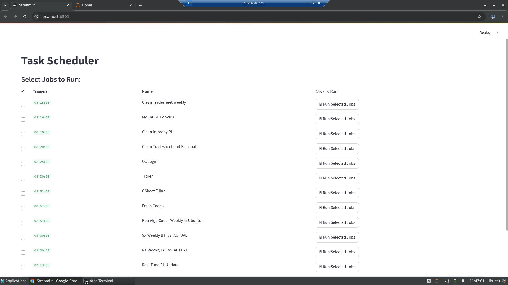
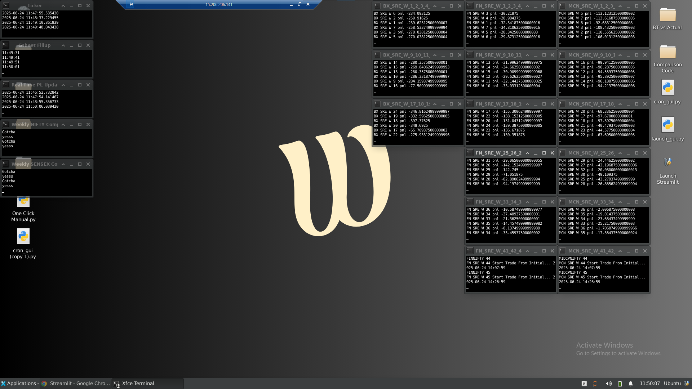

# 🧠 Live Quant Monitoring Dashboard on AWS (Ubuntu GUI + Streamlit)

A lightweight, real-time **task scheduler** and **monitoring dashboard** built on **AWS EC2** with **Ubuntu XFCE GUI** and **Streamlit**, designed for quantitative research and backtesting jobs.

---

## 🔧 What This Does

✅ Converts an AWS EC2 instance into a full Ubuntu GUI system using XFCE  
✅ Displays cron jobs in a web dashboard (Streamlit)  
✅ Enables one-click manual execution of scheduled scripts  
✅ Launches each task in a new terminal  
✅ Reduced AWS costs by ~50% vs Windows-based infra

---

## 📂 Project Structure

| Path | Description |
|------|-------------|
| `streamlit_app/streamlit_dashboard.py` | Streamlit app to list & run cron jobs |
| `streamlit_app/launch_gui_terminal.py` | Launch Streamlit GUI in xfce4-terminal |
| `screenshots/streamlit_dashboard.png` | Screenshot of GUI |
| `screenshots/streamlit_dashboard.png` | Screenshot of Streamlit App Task Scheduler |

---

## 🖼️ Task Scheduler StreamlitApp



## 🖼️ Aws Backtest Ubuntu-GUI-Server


---

## 💻 How to Deploy on AWS

### 1. Launch a t2.medium Ubuntu EC2 instance

### 2. SSH and run GUI setup
```bash```

## ⚙️ Requirements

- Ubuntu 20.04+
- Streamlit
- XFCE4
- Python 3.8+
- `crontab` and `xfce4-terminal` installed

---

## 📬 Contact

Harshit Chawla  
[LinkedIn](https://www.linkedin.com/in/harsh56/) • [Email](mailto:hshtchwl@gmail.com)
